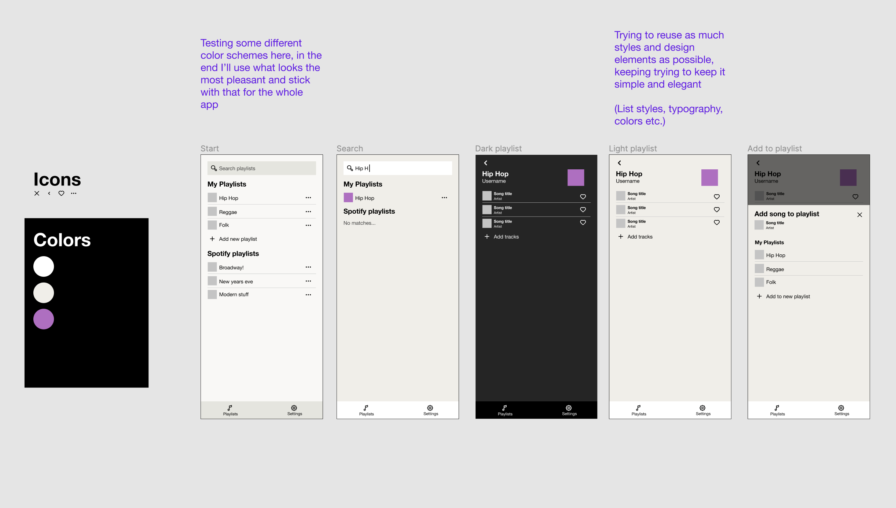

> Please note the sections added to the readme:
>
> 1. [A description of the app and how to run it locally](#doberman-music)
> 2. [Images that show the design process](#design-artefacts)
>
> To run the app locally you will need to get a `CLIENT_SECRET` for communication with the spotify api.
> And to authenticate in this service with your own account you need to be whitelisted by me (Fabian) in the Spotify Developer Console.

# Code test instructions

Build an application that fetches public playlists via an API from YouTube, Spotify or SoundCloud, present the content and create features that lets the user add their favourites to their own list. A good example of UI for this could be https://screenlane.com/screen/breethe-ios-app-05c-1/, but feel free to present it in which ever way you like.

The choice of technologies to solve this are up to you. How would you have solved this if the brief from a client was to use technology that was the best fit for this problem?

## Things we will look at at the follow up meeting

- Your approach to the problem as a whole
- How you structure your code
- Your git workflow
- CSS methodologies
- Code design patterns and architecture

## Doberman Music

A music app that let's you create playlists!
This project has been setup using create-react-app with the typescript template.

There are two parts to the service `doberman-music` which is the frontend built with React.
And `spotify-service` which is the backend built with express.

### Local development

You need to run both the frontend and the backend service locally for the app to work

In separate terminals go to both ./doberman-music and ./spotify-service and run the commands below

To install dependencies
`yarn`

Running the app in dev-mode
`yarn start`

## Design artefacts

**UI design from figma**

**Early skethes**

